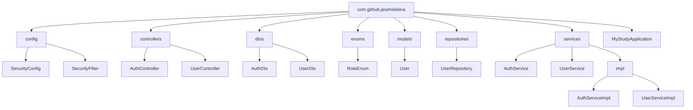

# Projeto Spring com Security e JWT Auth0

Este é um projeto desenvolvido com **Java 17** e **Spring Boot 3.4** que implementa autenticação JWT utilizando Spring Security e Auth0.

## Estrutura do Projeto

Abaixo está a estrutura principal do projeto com suas pastas e classes organizadas:


## Tecnologias Utilizadas

- **Java 17**: Versão LTS com suporte a recursos modernos.
- **Spring Boot 3.4**: Framework principal para a aplicação.
- **Spring Security**: Gerenciamento de autenticação e autorização.
- **JWT**: Implementação de JSON Web Tokens para autenticação.
- **Auth0**: Plataforma de autenticação segura.
- **Maven**: Gerenciamento de dependências.
- **Mermaid**: Utilizado para criar diagramas.

---

## Funcionalidades

- **Autenticação com JWT**: Implementação de tokens para proteger rotas e endpoints.
- **Segurança com Spring Security**: Protege os endpoints através de configurações robustas.
- **Gerenciamento de Usuários**: CRUD básico de usuários.
- **Perfis de Acesso**: Utiliza `RoleEnum` para diferenciar as permissões de usuário.

---

## Como Rodar o Projeto

### Clone o Repositório:

```bash
git clone https://github.com/jesimielsilva/spring-security-JWT.git
cd spring-security-JWT
```
### Configure o Banco de Dados

Atualize o arquivo `application.properties` com as configurações de seu banco.

---


